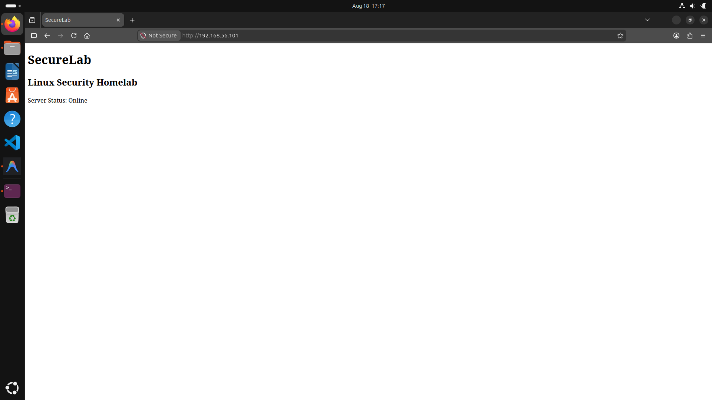
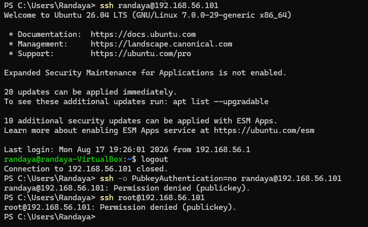
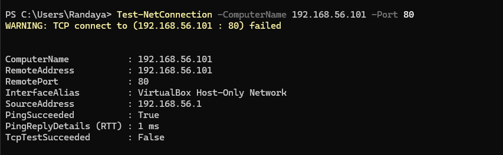

# SecureLab

A progressive Linux server security homelab built to practice real-world system administration, network security, and DevSecOps skills — one week at a time.

---

## Goal

Build one evolving project that demonstrates:

- Linux administration and hardening
- Network security and firewall configuration
- Security assessment and reporting
- Bash scripting for automation
- Containerization with Docker
- CI/CD and DevSecOps practices

---

## Architecture (v0.1)

```
Client
  ↓
HTTP (port 80)
  ↓
Ubuntu Server
  ↓
Nginx (Web Server)
```

---

## Tech Stack

| Area | Tools |
|---|---|
| OS | Ubuntu Linux |
| Remote Access | SSH |
| Web Server | Nginx |
| Firewall | UFW |
| Scripting | Bash |
| Scanning | Nmap |
| Version Control | Git / GitHub |

---

## Week 1 — Linux Server Security

### What was done

| Day | Task |
|---|---|
| Day 1 | System baseline — inspected OS, network, services and ports |
| Day 2 | SSH hardening — key-based auth, disabled root login and password auth |
| Day 3 | Firewall setup — UFW configured, only SSH (22) and HTTP (80) allowed |
| Day 4 | Nginx deployed — custom server status page live |
| Day 5 | Security audit script — Bash script for automated system inspection |
| Day 6 | Nmap assessment — scanned before and after hardening, documented findings |
| Day 7 | Repo cleanup — documentation reviewed, v0.1 tagged |

### Docs

- [`docs/baseline.md`](docs/baseline.md) — Initial system state
- [`docs/hardening.md`](docs/hardening.md) — SSH hardening steps
- [`docs/firewall.md`](docs/firewall.md) — Firewall configuration
- [`docs/security-assessment-01.md`](docs/security-assessment-01.md) — Nmap assessment report

### Scripts

- [`scripts/security-audit.sh`](scripts/security-audit.sh) — Bash security audit utility

### Scan Reports

- [`reports/scans/baseline.txt`](reports/scans/baseline.txt) — Nmap scan before hardening
- [`reports/scans/hardened.txt`](reports/scans/hardened.txt) — Nmap scan after hardening

---

## Screenshots

Nginx server status page:



SSH hardening verified:



Firewall rules applied:



---

## Lessons Learned

- Default Ubuntu installs expose more services than necessary — baseline inspection matters
- SSH key authentication eliminates a large class of brute-force risk
- UFW makes firewall management straightforward but understanding what is allowed and why is more important than the tool itself
- Nmap from an external perspective reveals what is actually visible, not just what is configured internally
- Documenting changes as you go is much easier than reconstructing them later

---

## Roadmap

- **v0.2** — Containerize the application with Docker and Docker Compose
- **v0.3** — Nginx reverse proxy in front of the containerized app
- **v1.0** — Python log analyzer, security reporting, full DevSecOps pipeline

---

