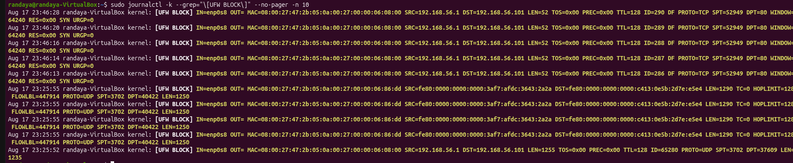

# Host Firewall (UFW) Hardening & Ingress Audit

**Target Environment:** Ubuntu 26.04 LTS (Guest VM)  
**Host Environment:** Windows 11 (PowerShell Client)  
**Document Type:** Network Security Baseline & Verification Audit  
**Status:** Completed & Verified  

---

## 1. Objective & Security Baseline

Enforce a **Default-Deny Ingress / Default-Allow Egress** network posture on Ubuntu 26.04 using Uncomplicated Firewall (UFW). The goal is to eliminate unsolicited exposure, restrict administrative access to rate-limited SSH, and log unauthorized network probes.

---

## 2. Configuration & Policy Matrix

### 2.1 Global Policies
```bash
sudo ufw default deny incoming
sudo ufw default allow outgoing
sudo ufw default deny routed
sudo ufw logging medium
```

### 2.2 Active Rule Table
| Rule | Action | Interface / Source | Threat Mitigated & Purpose |
|---|---|---|---|
| `22/tcp` | `LIMIT IN` | `Anywhere` | Mitigates SSH brute-force attacks (throttles $\ge 6$ connections in 30s). |
| `22/tcp (v6)` | `LIMIT IN` | `Anywhere (v6)` | Extends rate limiting across IPv6 stack. |
| Ingress Default | `DENY` | All Interfaces | Silently drops all unsolicited external network traffic. |
| Egress Default | `ALLOW` | All Interfaces | Permits system updates (`apt`) and external outbound queries. |

---

## 3. Verification & Validation Evidence

All tests were performed from Windows PowerShell against target `192.168.56.101`.




- **Analysis:** Verifies ingress filtering on the Host-Only interface (`enp0s8`), dropping unsolicited broadcast discovery traffic from the Windows host (`192.168.56.1`).

---

## 4. Key Operational Takeaways

1. **Dual-Adapter Traffic Separation**: Outbound package retrieval runs over NAT (`enp0s3`), while administrative management is isolated to Host-Only (`enp0s8`).
2. **Rate Limiting vs. Simple Allow**: Using `ufw limit` introduces automated IP throttling at the kernel level without requiring third-party intrusion prevention tools.
3. **Audit Visibility**: Medium logging provides SOC-level audit trails in `/var/log/ufw.log` and system journals for incident investigation.
